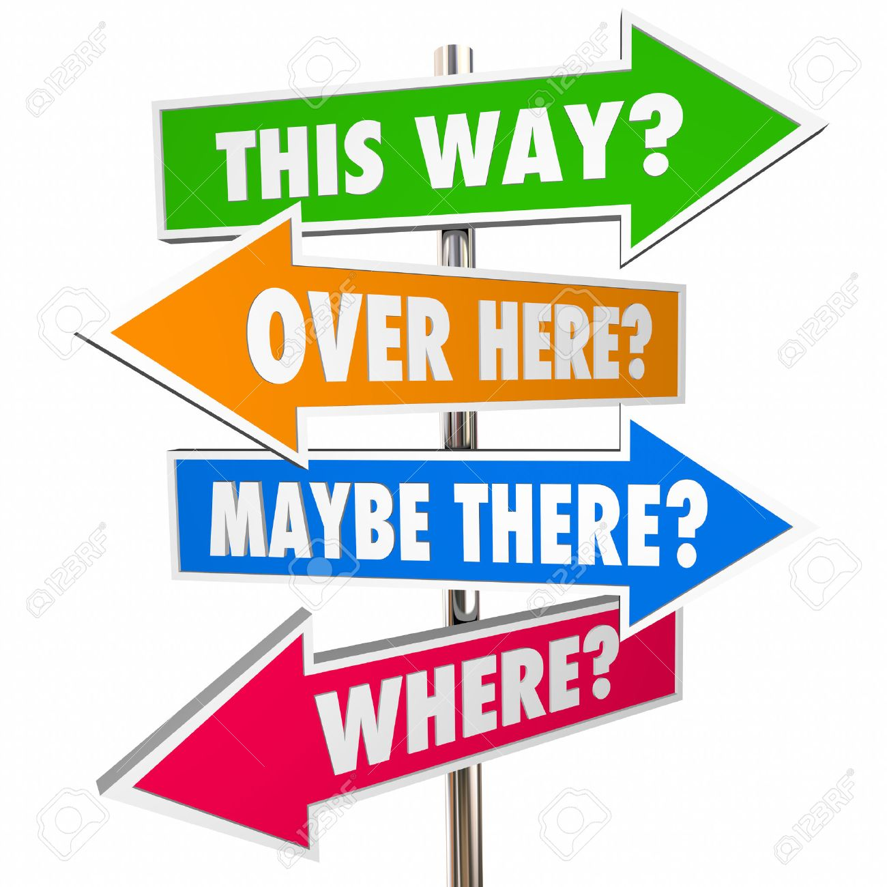

<div style="flex-layout: row;">
  
  
</div>

---

Demo of blackbox gradient free optimisation of NN 


## Installation
---


```bash
$ git clone https://github.com/JonasRSV/random-direction-ascent.git
$ cd random-direction-ascent
$ pip3 install -r requirements.txt
``` 

pyglet & pybox2d might need some additional requirements (see eventual error messages)


## Run any of the environments 
---

```bash
$ python3 (mountaincar.py | lunar-lander.py | pendelum.py | cartpole.py)
```


|environment   | score  | iteration  | score to win environment  |
|---|---|---|---|
| mountain car   |   |   |   |
| lunar lander   |   |   |   |
| pendelum   |   |   |   |
| cartpole  |   |   |   |
